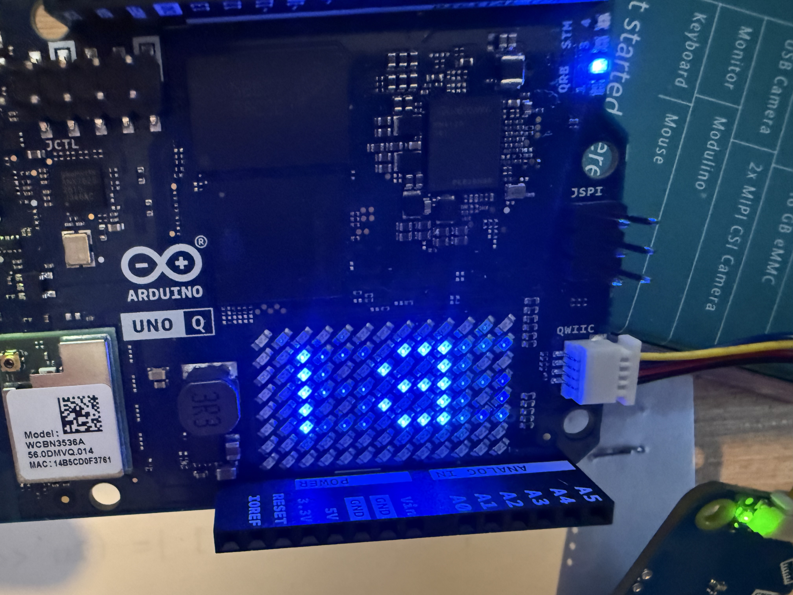

# Horloge LED 13×8 avec niveaux de luminosité – Arduino UNO Q

## Objectif
Ce projet affiche l’heure (HH:MM) sur la matrice LED **13×8** de l’Arduino **UNO Q**, en exploitant :
- le **cœur Linux** (Python) pour fournir l’heure via RPC,
- la bibliothèque **Arduino_LED_Matrix** pour gérer les **niveaux de luminosité (niveaux de gris)**,
- un rendu différencié : **chiffres des dizaines plus lumineux** que les unités.

Contrairement à un affichage binaire (ON/OFF), chaque LED reçoit ici une **intensité** (0..255 ou 0..7 selon la configuration).

---

## Principe général
1. Le cœur Linux appelle la fonction RPC `updateTime(hour, minute, second)`.
2. Le code Arduino construit un **buffer de 104 octets** (13×8 LEDs).
3. Chaque LED reçoit une valeur d’intensité :
   - dizaines : luminosité forte,
   - unités : luminosité plus faible,
   - séparateur `:` : luminosité intermédiaire.
4. Le buffer est transmis à la matrice via `matrix.draw()`.

Chaque LED est donc représentée par **un octet**, et non plus par un simple bit.

---

## Initialisation de la matrice

```cpp
Arduino_LED_Matrix matrix;

void setup() {
  matrix.begin();
  matrix.setGrayscaleBits(8); // niveaux 0..255
  matrix.clear();
}
```

- `setGrayscaleBits(8)` indique que chaque LED accepte une intensité sur 8 bits.
- Si nécessaire, on peut utiliser `setGrayscaleBits(3)` pour des niveaux 0..7.

---

## Géométrie de la matrice

```cpp
const int MATRIX_WIDTH  = 13;
const int MATRIX_HEIGHT = 8;
```

La matrice contient **104 LEDs**, indexées linéairement de 0 à 103.

La conversion (x, y) → index linéaire est définie par :

```cpp
static inline int idx(int x, int y) {
  return y * MATRIX_WIDTH + x;
}
```

---

## Représentation des chiffres (glyphes 3×5)

Les chiffres 0 à 9 sont décrits sous forme de **glyphes binaires 3×5** :

```cpp
const uint8_t DIGITS[10][5];
```

Chaque ligne utilise 3 bits :
- bit 2 : colonne gauche
- bit 1 : colonne centrale
- bit 0 : colonne droite

Exemple pour le chiffre 0 :
```
###
# #
# #
# #
###
```

---

## Écriture d’un pixel avec intensité

```cpp
void setPixelIntensity(uint8_t frame[104], int x, int y, uint8_t intensity) {
  if (x < 0 || x >= MATRIX_WIDTH) return;
  if (y < 0 || y >= MATRIX_HEIGHT) return;
  frame[idx(x, y)] = intensity;
}
```

- `frame[104]` contient une valeur d’intensité par LED.
- `intensity` dépend du rôle du pixel (dizaine, unité, séparateur).

---

## Dessin d’un chiffre avec luminosité donnée

```cpp
void drawDigitIntensity(uint8_t frame[104], int digit, int xOffset, uint8_t intensity);
```

Fonctionnement :
- lecture du glyphe 3×5,
- parcours ligne par ligne et colonne par colonne,
- chaque bit actif déclenche un appel à `setPixelIntensity()` avec l’intensité choisie.

---

## Construction de l’affichage de l’heure

```cpp
void buildClockFrame(uint8_t frame[104], int hour, int minute, bool showColon);
```

Étapes :
1. Remise à zéro du buffer.
2. Découpage de l’heure :
   - dizaines / unités heures,
   - dizaines / unités minutes.
3. Application des intensités :
   - dizaines : forte luminosité,
   - unités : luminosité plus faible,
   - `:` : intermédiaire.
4. Placement des chiffres sur la matrice.

Les constantes suivantes contrôlent le rendu :

```cpp
const uint8_t I_TENS  = 255;
const uint8_t I_UNITS = 160;
const uint8_t I_COLON = 160;
```

---

## Réception de l’heure via RPC

```cpp
void updateTime(int32_t hour, int32_t minute, int32_t second);
```

- appelée depuis le cœur Linux,
- vérifie la validité des valeurs,
- gère le clignotement du séparateur,
- construit le frame,
- envoie le buffer à la matrice avec `matrix.draw(frame)`.

---

## Différence avec un affichage binaire

| Affichage binaire | Affichage avec intensité |
|------------------|--------------------------|
| 1 bit par LED    | 1 octet par LED          |
| ON / OFF         | 0..255 (ou 0..7)         |
| `matrixWrite()`  | `matrix.draw()`          |

Ce projet exploite pleinement les capacités de la matrice LED de la UNO Q.

---

## Conclusion

Ce programme montre :
- comment utiliser la matrice LED 13×8 en **niveaux de gris**,
- comment hiérarchiser visuellement l’information (dizaines vs unités),
- comment interfacer proprement le cœur Linux et le code Arduino.

Le code privilégie la **lisibilité** et la **compréhension du cheminement**, du chiffre abstrait jusqu’à l’intensité affichée sur chaque LED.

---
## Aperçu



LE RENDU N'EST PAS TRES BON AVEC LA PHOTO - EN REALLITE C'EST MIEUX
---

## Credits

- Projet, conception et implémentation : philippe86220
- Accompagnement pédagogique, explications détaillées et aide à la compréhension du code : ChatGPT (OpenAI)

